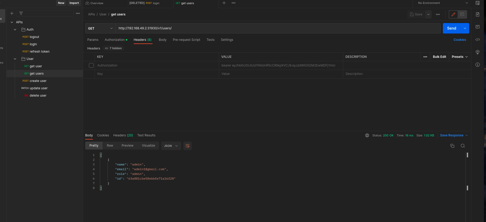

# Deall ─ Backend Engineer Test

## Problem Statement

### The Challenge

1. Create Rest API CRUD User and User Login using NodeJS (or Golang).
2. If you're using NodeJS, we suggest you use ExpressJS. You can use databases from anywhere, but MongoDB is recommended.
3. Login with username and password to access API CRUD (token, but refresh token would be a plus).
4. Make two users with roles: 1 Admin, and 1 User.
5. The Admin has access to all API CRUD, while the User only gets access to the user's data (Read).
6. Architecture Microservices implemented using Kubernetes with Docker container deploy in a VPS (1 node with some pods inside). If you don't have a VPS, then you'll need to:
   Preparing the YML for running the application in containerized mode and ready for Kubernetes deployment.
   Deploy the application locally and take a screenshot for the attachment.
7. Upload source code by using GitHub Repository with the script of YML Kubernetes.
8. API documentation (Postman or Swagger) should be made available to the API rest server.
9. Make an architecture diagram that shows the flow of API CRUD and Login.
10. Attach the Admin credential in the Readme.

### Submission

You have 5x24 hours to work on the challenge & please submit directly through Deall dashboard.

## Solution

### API Flow Diagrams

- [draw.io document](https://drive.google.com/file/d/1NDdcxkXz_80wLe2gU2OHi0cmWkEptF6a/view?usp=sharing)

#### Login


#### Refresh Token


-

#### Access Guarded Endpoints


#### Access Unguarded Endpoint


### How to Deploy Locally with Minikube

start minikube with this command

```
$ minikube start
```

applay the yaml file with this command

```
$ kubectl apply -f kube
```

get the url to access the app with this command

```
$ minikube service deall --url
```


### How to Initiate Admin User Account

Show the list of pods

```
$ kubectl get pod
```

Get into the cli of the nodejs app

```
$ kubectl exec --stdin --tty <pod name> -- /bin/bash
```

execute the provided script inside /src/scripts

```
$ node src/scripts/createSuperUser.js
```

it will create an admin user with credentials of

- email: admin1@gmail.com
- password: 12345678a

### API Documentation

[postman json file](./APIs.postman_collection.json)

[request.http file](./request.http)

### Screenshots of Local Deployment



